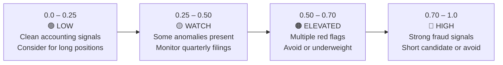

# Score Interpretation

## The Composite Score

The composite fraud score is a calibrated probability from 0.0 to 1.0.

**It answers the question:** "Based on this company's accounting patterns over the past 1, 3, and 5 years, what is the probability that it belongs to the historical population of fraud/accounting-manipulation cases?"

It is **not** a prediction that fraud will definitely happen. It is a signal that the accounting profile resembles past cases.

## Score Zones



| Zone | Score Range | Action |
|---|---|---|
| Low | 0.00 – 0.25 | Accounting looks clean. Eligible for long positions in SCDV/QEM strategies. |
| Watch | 0.25 – 0.50 | Some anomalies. Monitor next filing. Not disqualifying alone. |
| Elevated | 0.50 – 0.70 | Multiple signals present. Avoid new positions. |
| High | 0.70 – 1.00 | Strong fraud signal. Short candidate for leverage strategy. |

## Score Components

The composite score is the mean of three horizon scores:

```
composite = mean(score_1y, score_3y, score_5y)
```

A company with score_1y=0.80 but score_5y=0.20 is a recent deterioration — watch the filing trend closely. A company with all three scores above 0.70 is a long-standing accounting concern.

## Supporting Indicators

The model uses three classical benchmarks alongside the ML score:

### Beneish M-Score

8-component accrual-based manipulation indicator. Threshold: **−2.22**

| M-Score | Interpretation |
|---|---|
| > −1.78 | High probability of manipulation |
| −2.22 to −1.78 | Grey zone — borderline |
| < −2.22 | Unlikely manipulator |

The 8 components: Days Sales in Receivables Index (DSRI), Gross Margin Index (GMI), Asset Quality Index (AQI), Sales Growth Index (SGI), Depreciation Index (DEPI), Sales General and Admin Expenses Index (SGAI), Leverage Index (LVGI), Total Accruals to Total Assets (TATA).

### Altman Z-Score

Bankruptcy predictor combining profitability, leverage, liquidity, and activity ratios.

| Z-Score | Zone |
|---|---|
| > 2.99 | Safe zone |
| 1.81 – 2.99 | Grey zone |
| < 1.81 | Distress zone |

Used as a quality gate in the leverage strategy — companies in the distress zone are excluded from long positions.

### Piotroski F-Score

9-point quality scoring system covering profitability (4 tests), leverage/liquidity (3 tests), and operating efficiency (2 tests).

| F-Score | Quality |
|---|---|
| 8 – 9 | Strong |
| 6 – 7 | Good — eligible for leverage strategy |
| 4 – 5 | Average |
| 0 – 3 | Weak |

## Confidence Score

Every composite score is published with a companion confidence level:

```
Confidence = f(features_present, data_recency, company_size, score_stability)
```

| Confidence | Meaning |
|---|---|
| High | 10+ features present, recent filing, stable score across 3 horizons |
| Medium | 6–9 features, filing ≤ 18 months, moderate score variance |
| Low | < 6 features, stale filing, or score unstable across horizons |

A Low-confidence High score still warrants attention — it means the limited data that is available is raising flags. A High-confidence Low score means the model has solid data and sees clean accounting.

## What Drives the Score (SHAP)

The Company Profile tab shows a SHAP attribution chart: which features pushed the score up (red bars) and which pulled it down (blue bars).

Common high-impact features:

| Feature | Direction | What it captures |
|---|---|---|
| `accruals_to_assets` | High → higher score | Beneish TATA — gap between earnings and cash |
| `revenue_growth_ratio` | Very high → higher score | SGI anomaly — suspicious revenue acceleration |
| `days_sales_receivables_index` | >1.0 → higher score | Receivables growing faster than revenue |
| `asset_quality_index` | >1.0 → higher score | Non-current assets growing disproportionately |
| `auditor_change` | 1.0 → higher score | Auditor resignation or change (binary flag) |
| `piotroski_f_score` | Low → higher score | Deteriorating fundamentals |
| `free_cash_flow_to_net_income` | Low → higher score | Earnings not converting to cash |
