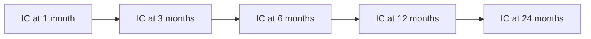

# Factor Research

The factor research library (`scripts/analysis/factor_research.py`) provides IC/ICIR analysis tools for evaluating and selecting predictive features.

## What is IC?

**IC (Information Coefficient)** is the Spearman rank correlation between a feature and the forward return:

```
IC_t = spearman_corr(feature_values_at_year_t, return_at_year_t+horizon)
```

- IC = +1.0: perfect positive predictor
- IC = 0.0: no predictive power
- IC = −1.0: perfect negative predictor (useful for short signals)

Features with |IC| > 0.05 consistently are considered meaningful.

## What is ICIR?

**ICIR (IC Information Ratio)** measures IC stability:

```
ICIR = mean(IC over rolling window) / std(IC over rolling window)
```

A feature with mean IC = 0.10 and ICIR = 2.0 is more reliable than one with mean IC = 0.15 and ICIR = 0.5 (highly variable). ICIR is the primary selection criterion.

## Factor Decay

Factor decay measures how quickly predictive power fades as the holding period increases:



A feature with rapid decay (IC halves by month 3) is useful only for short-term holding. A feature with slow decay (IC still positive at 24 months) is better for annual rebalancing.

**Typical decay patterns observed:**

| Feature Type | Decay Speed | Holding Period Suitability |
|---|---|---|
| Price momentum | Fast (3–6M) | Short holding only |
| Accrual ratios | Medium (6–12M) | Annual rebalancing |
| Governance flags | Slow (12–24M) | Multi-year holding |
| Macro context | Slow (12–24M) | Strategic allocation |

## Feature Correlation

Before finalizing the feature set, Spearman correlations are computed pairwise. Features with |correlation| > 0.90 are considered redundant — only the higher-ICIR feature from each correlated pair is kept.

This prevents the model from learning essentially the same signal through multiple collinear features.

## Running Factor Research

```bash
# IC/ICIR analysis for all features
python3 scripts/analysis/factor_research.py

# Single feature analysis
python3 scripts/analysis/factor_research.py --feature accruals_to_assets

# Decay analysis
python3 scripts/analysis/factor_research.py --mode decay --horizons 1 3 6 12 24

# Export results
python3 scripts/analysis/factor_research.py --export reports/factor_ic.csv
```

## Research Notebooks

The `research/` directory contains Jupyter notebooks for exploratory analysis:

| Notebook | Purpose |
|---|---|
| `01_data_exploration.ipynb` | Dataset overview, distributions, missing values |
| `02_factor_analysis.ipynb` | IC/ICIR charts, decay plots, correlation heatmaps |
| `03_ml_model.ipynb` | Full ML pipeline, SHAP analysis, walk-forward |
| `04_bias_audit.ipynb` | Look-ahead, survivorship, and leakage tests |
| `05_leverage_analysis.ipynb` | Long/short portfolio construction analysis |

## Alphalens-style Tearsheet

The research library includes an Alphalens-style factor tearsheet output (cells in `02_factor_analysis.ipynb`):

- **Returns analysis** — mean return by quintile at 1M/3M/6M/12M
- **IC time series** — IC per period with rolling mean
- **Turnover analysis** — how often does the factor's top quintile change?
- **Sector breakdown** — IC by SIC sector (some factors are sector-specific)
