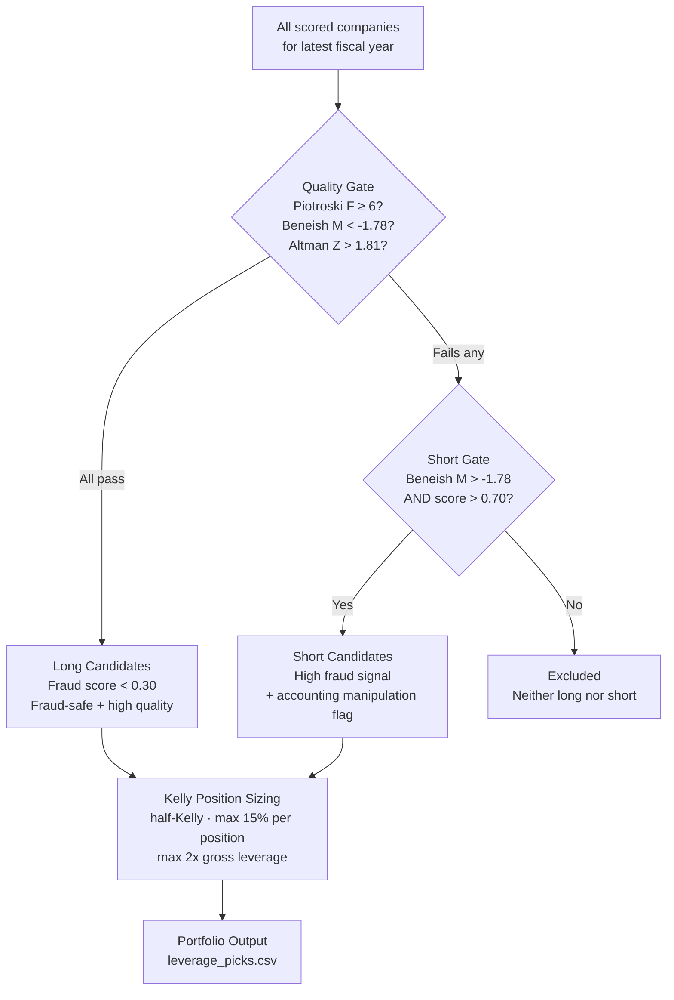

# Leverage Strategy

The leverage strategy constructs a long/short portfolio using fraud scores with position sizing governed by the Kelly criterion.

## Strategy Logic



## Quality Gates

Long positions require passing **all three** gates:

| Gate | Threshold | Rationale |
|---|---|---|
| Piotroski F-Score | ≥ 6 | Fundamental quality filter — eliminates deteriorating businesses |
| Beneish M-Score | < −1.78 | Accrual quality — below borderline manipulation zone |
| Altman Z-Score | > 1.81 | Solvency — excludes distress zone companies |

Short candidates require:
- Beneish M-Score > −1.78 (borderline or likely manipulator)
- Composite fraud score > 0.70 (strong model signal)

## Kelly Criterion Sizing

```
kelly_fraction = (p × b - q) / b

where:
  p = probability of gain (estimated from composite score for longs)
  q = 1 - p (probability of loss)
  b = average win/loss ratio (from backtest history)
```

Half-Kelly is used (50% of the full Kelly fraction) to reduce drawdown risk from estimation errors.

```python
HALF_KELLY_FRACTION = 0.5
MAX_POSITION_PCT    = 0.15    # Hard cap: no position > 15%
MAX_LEVERAGE        = 2.0     # Gross leverage cap: 2x
```

Positions are normalized so the sum of absolute weights equals 1.0 (or ≤ 2.0 for levered portfolios).

## Instrument Selection

For long positions:

| Market Cap | Preferred Instrument | Rationale |
|---|---|---|
| < USD 500M | Direct equity | LEAPS options often unavailable or illiquid |
| USD 500M – 2B | LEAPS (1-2 year) or direct equity | Option leverage without margin maintenance |
| > USD 2B | Margin or LEAPS | Deep options markets, reasonable bid-ask spreads |

For short positions:
- Locate borrow first — if borrow unavailable or cost > 5% annualized, exclude from portfolio
- Short via margin account (direct short sale)

## Running the Strategy

```bash
# Default: top 20 long + top 10 short
python3 scripts/portfolio/leverage_strategy.py

# Custom universe size
python3 scripts/portfolio/leverage_strategy.py --top-long 15 --top-short 8

# Long-only mode (no shorts)
python3 scripts/portfolio/leverage_strategy.py --long-only

# Custom thresholds
python3 scripts/portfolio/leverage_strategy.py --min-piotroski 7 --max-beneish -2.0

# Custom output path
python3 scripts/portfolio/leverage_strategy.py --output reports/leverage_picks.csv
```

## Output Columns

`data/leverage_positions_<market>.csv`:

| Column | Description |
|---|---|
| `ticker` | Company ticker |
| `name` | Company name |
| `composite_score` | Blended rank score (value + quality + ML) |
| `leverage_safe` | 1 if all quality gates pass, 0 otherwise |
| `position_pct` | Portfolio weight (%) |
| `position_€` | Capital allocated (€) |
| `leverage_mult` | Applied leverage multiplier |
| `notional_€` | Gross notional exposure (€) |
| `strategy` | Instrument recommendation (LEAPS / margin / equity) |
| `piotroski_f` | Piotroski F-score |
| `beneish_m` | Beneish M-score |
| `ml_1y` | ML model probability of beating market (1-year horizon) |

## Risk Management

!!! danger "This strategy involves real financial risk"
    - Short positions have unlimited theoretical loss
    - Small caps can be illiquid — limit orders required, slippage budget is critical
    - Kelly sizing is only as good as the underlying probability estimates
    - The model has a 1-year validation AUC of 0.749 — it is wrong 25% of the time
    - Do not deploy without a stop-loss framework

Recommended position-level stop-loss: 20% adverse move triggers review. 30% adverse move triggers exit regardless of model signal.
