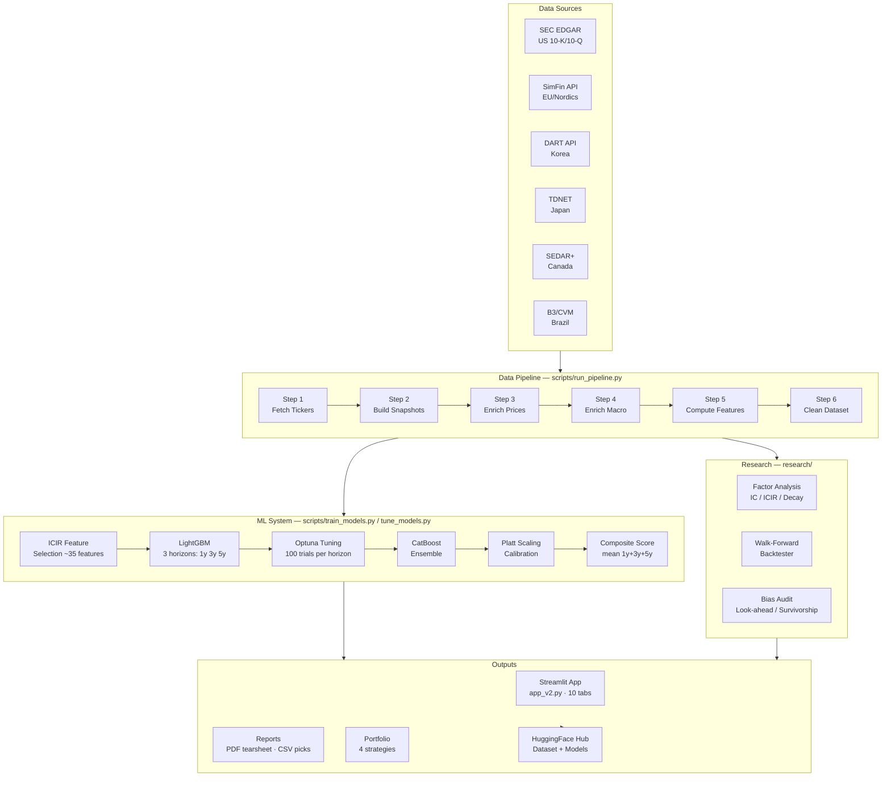
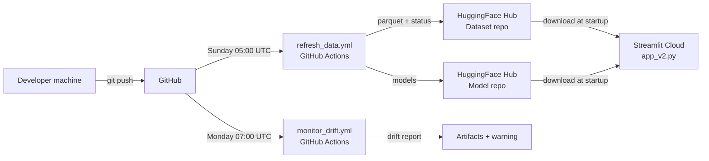

# System Architecture

The screener is a research-grade pipeline from raw filings to portfolio construction.

## High-Level Overview

## Component Map

| Component | Location | Purpose |
|---|---|---|
| US pipeline | `scripts/run_pipeline.py` | Fetch + clean US fundamentals |
| EU / multi-market | `pipeline/step1_fetch_tickers.py` – `step6_clean_dataset.py` | 14-market unified pipeline |
| KR integration | `pipeline/phase_a_integrate_kr.py` | DART KR data integration |
| Feature library | `pipeline/feature_library.py` | 313 feature definitions |
| Train models | `scripts/train_models.py` | LightGBM with ICIR selection |
| Tune models | `scripts/tune_models.py` | Optuna + calibration |
| Backtester | `scripts/backtester.py` | Walk-forward strategy simulation |
| Factor research | `scripts/factor_research.py` | IC/ICIR/decay library |
| Leverage strategy | `scripts/leverage_strategy.py` | Long/short Kelly sizing |
| Monitor drift | `scripts/monitor_drift.py` | PSI + AUC monitoring |
| Generate reports | `scripts/generate_reports.py` | PDF tearsheet + weekly picks |
| App | `app_v2.py` | 8-tab Streamlit interface |

## Data Flow Detail

```mermaid
flowchart LR
    A[Raw API calls<br/>SimFin / EDGAR / DART] -->|ticker lists| B[Ticker Registry<br/>per market]
    B -->|company metadata| C[Annual Snapshots<br/>fiscal_year × ticker]
    C -->|OHLCV joins| D[Price-Enriched<br/>Snapshots]
    D -->|macro joins<br/>T-bill · inflation| E[Macro-Enriched<br/>Snapshots]
    E -->|313 formulas| F[Feature Matrix<br/>historical_dataset_clean.parquet]
    F -->|ICIR filter| G[~35 features/horizon]
    G -->|LightGBM fit| H[Base Models]
    H -->|Optuna search| I[Tuned Models]
    I -->|CatBoost blend| J[Ensemble]
    J -->|Platt scaling| K[Calibrated Proba 0–1]
    K -->|mean of 1y+3y+5y| L[Composite Score]
```

## Deployment Architecture

