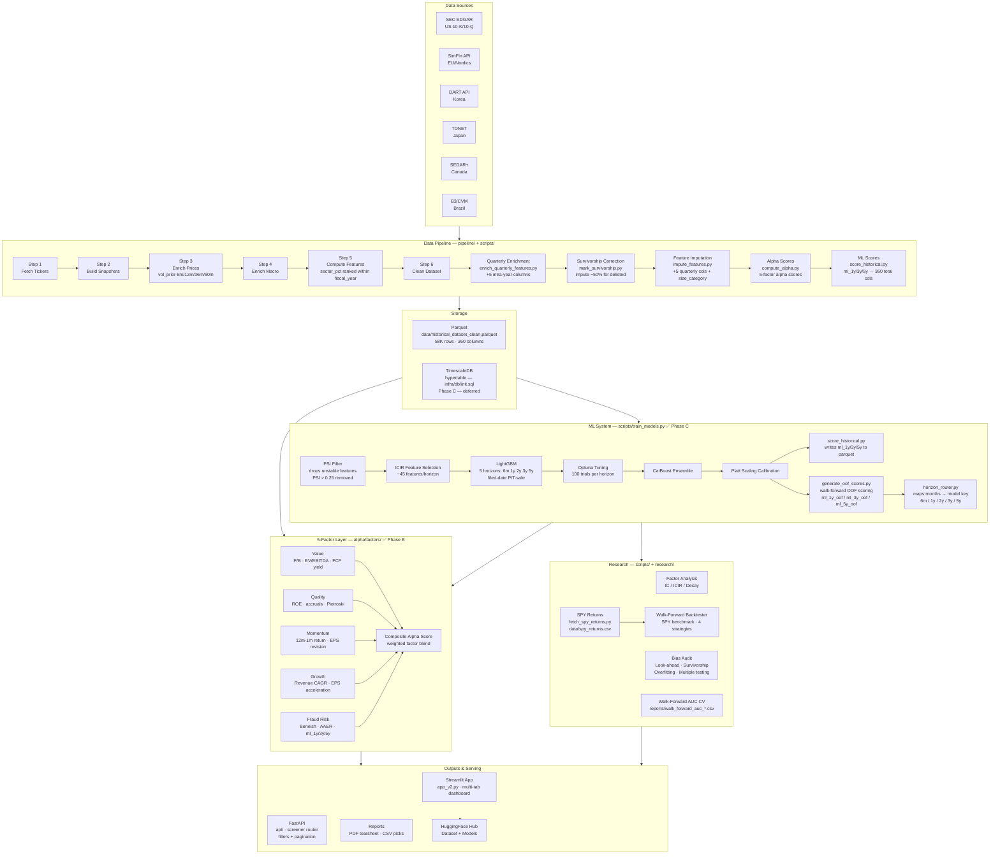
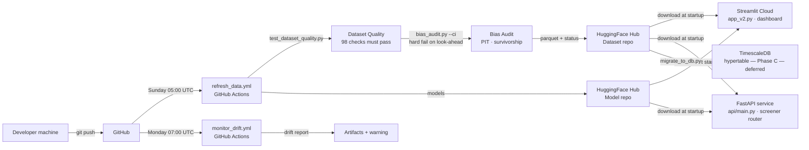

# System Architecture

A research-grade quantitative alpha generation platform — from raw filings to portfolio construction.

## High-Level Overview

## Component Map

| Component | Location | Purpose | Status |
|---|---|---|---|
| US pipeline | `scripts/run_pipeline.py` | Fetch + clean US fundamentals | ✅ |
| Multi-market pipeline | `pipeline/step1_*.py` – `step6_*.py` | 14-market unified pipeline | ✅ |
| KR integration | `pipeline/phase_a_integrate_kr.py` | DART KR data integration | ⚠️ running |
| Feature library | `pipeline/feature_library.py` | 326 feature definitions | ✅ |
| Quarterly enrichment | `scripts/enrich_quarterly_features.py` | 5 intra-year dynamics | ✅ |
| Feature imputation | `scripts/impute_features.py` | Quarterly cols + size_category recovery → 341 cols | ✅ |
| Equity + vol patch | `scripts/patch_equity_vol_features.py` | Fix equity coalesce bug + add 5 vol/roa cols → 346 cols | ✅ (one-time; logic now in step3/step5) |
| Beneish/Altman/Piotroski | `pipeline/step5_compute_features.py` | Fixed DEPI (was 1.0), Altman X4 book-equity fallback for non-US, Piotroski F6 Δ(current_ratio); growth features winsorized at p1/p99 | ✅ |
| Montier C-Score + Richardson accruals | `pipeline/step5_compute_features.py` | Montier C-Score (6-binary, Montier 2008) + `sloan_wc_accruals` + `sloan_lt_accruals` (Richardson 2005). C2 uses `ppe_net` — do not change to `property_plant_equipment` (95.7% null) | ✅ |
| Survivorship correction | `scripts/mark_survivorship.py` | Impute −50% return for likely-delisted | ✅ |
| AAER fraud labels | `scripts/fetch_aaer_labels.py` | 492 positive rows / 118 companies | ✅ |
| Train models | `scripts/train_models.py` | LightGBM 5 horizons (6m/1y/2y/3y/5y), filed-date PIT-safe, PSI filter + ICIR selection, n_estimators=600 | ✅ Phase C |
| Tune models | `scripts/tune_models.py` | Optuna 100 trials + CatBoost ensemble + Platt calibration | ✅ |
| OOF scorer | `scripts/generate_oof_scores.py` | Walk-forward OOF → ml_1y_oof / ml_3y_oof / ml_5y_oof (unbiased, NaN for train rows) | ✅ Phase C |
| Historical ML scoring | `scripts/score_historical.py` | Load models → write ml_1y/3y/5y to parquet | ✅ |
| SPY benchmark data | `scripts/fetch_spy_returns.py` | Downloads SPY annual calendar-year returns → data/spy_returns.csv | ✅ Phase C |
| Horizon router | `alpha/horizon_router.py` | Maps investment horizon (months) to nearest discrete model key (6m/1y/2y/3y/5y) | ✅ Phase C |
| **Alpha factor package** | `alpha/factors/` | 5-factor scores: Value · Quality · Momentum · Growth · Fraud Risk | ✅ |
| Backtester | `scripts/backtester.py` | Walk-forward simulation · SPY benchmark · factor attribution (beta/alpha/R²/tracking_error) · 4 strategies | ✅ Phase C |
| Factor research | `scripts/factor_research.py` | IC/ICIR/decay analysis | ✅ |
| Leverage strategy | `scripts/leverage_strategy.py` | Long/short Kelly sizing | ✅ |
| Monitor drift | `scripts/monitor_drift.py` | PSI + AUC monitoring | ✅ |
| Bias audit | `scripts/bias_audit.py` | 4 audits: look-ahead (PIT) · survivorship · overfitting (overfit_gap) · multiple testing (Bonferroni) | ✅ Phase C |
| Generate reports | `scripts/generate_reports.py` | PDF tearsheet + weekly picks | ✅ |
| DB migration | `scripts/migrate_to_db.py` | Load parquet → TimescaleDB hypertable | Phase C — deferred |
| App | `app_v2.py` | Streamlit dashboard (Phase 2: add 5-factor UI) | ✅ |
| FastAPI | `api/` | REST screener with filters + pagination | ✅ |

## Data Flow Detail

```mermaid
flowchart LR
    A[Raw API calls<br/>SimFin / EDGAR / DART] -->|ticker lists| B[Ticker Registry<br/>per market]
    B -->|company metadata| C[Annual + Quarterly Snapshots<br/>fiscal_year × ticker]
    C -->|OHLCV joins| D[Price-Enriched<br/>Snapshots]
    D -->|macro joins<br/>T-bill · inflation| E[Macro-Enriched<br/>Snapshots]
    E -->|321 formulas| F[Feature Matrix<br/>pre-quarterly enrichment<br/>58K rows · 321 cols]
    F -->|+5 quarterly dynamics| Q[Quarterly-Enriched<br/>historical_dataset_clean.parquet<br/>58K rows · 326 cols]
    Q -->|delisted imputation| SB[Survivorship-Corrected<br/>likely_delisted flag]
    SB -->|quarterly imputation<br/>+ size_category| IMP[Imputed Dataset<br/>58K rows · 341 cols]
    IMP -->|Montier C-Score<br/>+ Sloan accruals| FEAT[Feature-Complete Dataset<br/>58K rows · 360 cols]
    FEAT -->|PSI filter<br/>PSI > 0.25 removed| PSI[PSI-Filtered Candidates<br/>~185 features]
    PSI -->|ICIR filter| G[~45 features/horizon]
    G -->|LightGBM fit<br/>5 horizons: 6m 1y 2y 3y 5y| H[Base Models]
    H -->|Optuna search| I[Tuned Models]
    I -->|CatBoost blend| J[Ensemble]
    J -->|Platt scaling| K[Calibrated Proba 0–1]
    K -->|score_historical.py| L[ml_1y / ml_3y / ml_5y<br/>written back to parquet]
    K -->|generate_oof_scores.py<br/>walk-forward OOF| OOF[ml_1y_oof / ml_3y_oof / ml_5y_oof<br/>NaN for training rows]
    OOF -->|horizon_router.py<br/>months → model key| HR[HorizonRouter<br/>6m · 1y · 2y · 3y · 5y]
    L -->|compute_alpha.py| FA[5-Factor<br/>Composite Alpha Score<br/>341 → 360 cols total]
    SB -->|bulk load| DB[TimescaleDB<br/>hypertable — Phase C — deferred]
```

## Deployment Architecture

