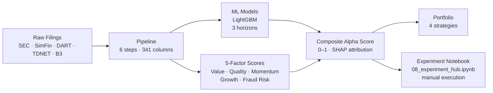

# Multi-Factor Stock Screener & Alpha Generation Platform

**A research-grade quantitative alpha lab targeting ≥25% annualised ROI — covering 14 markets: US, Korea, Canada, Japan, Brazil, and 9 European markets.**

The platform scores companies across five orthogonal factor groups — **Value, Quality, Momentum, Growth, and Fraud Risk** — and combines them into a composite alpha score. It trains LightGBM models on 6-month, 1-year, 2-year, 3-year, and 5-year return horizons using 58,190 company-year observations and 361 columns (355 base features + 5 OOF score columns + 1 regression magnitude column). Feature selection uses PSI (threshold 0.25) → IC → ICIR (Newey-West HAC t-stats + BH FDR q<0.05) → Spearman deduplication. FORCE_INCLUDE momentum features injected for 6m/1y/2y horizons where ICIR under-selects momentum vs fundamentals. Sector-neutral IC (SIC-based demeaning) applied throughout.

---

## Performance at a Glance

| Model Horizon | Validation AUC | Tuned Val AUC | WF Mean AUC | Target |
|---|---|---|---|---|
| 6-month | 0.607 | **0.617** | 0.5715 | ≥ 0.58 ❌ |
| 1-year | 0.599 | **0.605** | **0.5774** | ≥ 0.62 ❌ |
| 2-year | 0.585 | **0.606** | 0.5880 | ≥ 0.60 ❌ |
| 3-year | 0.635 | **0.664** | 0.6248 | ≥ 0.62 ✅ |
| 5-year | — | — | 0.6200 | ≥ 0.62 ✅ |

| Strategy | CAGR (net) | Excess vs SPY | Sharpe |
|---|---|---|---|
| COMPOSITE | +38.1% | +24.2% vs SPY | 1.181 |

---

## Choose Your Starting Point

=== "I want to use the notebook"

    **[Quick Start →](quickstart.md)** — install and run in 5 minutes

    **[Architecture →](architecture.md)** — system overview and data flow

    **[Score Interpretation →](guide/scores.md)** — what the numbers mean

=== "I want to understand the research"

    **[Architecture →](architecture.md)** — system overview and data flow

    **[Factor Library →](methodology/factor-library.md)** — 5-factor design, IC targets, composite weights

    **[ML Models →](methodology/models.md)** — feature selection, training, ensembling

    **[Backtesting →](methodology/backtesting.md)** — walk-forward validation methodology

    **[Bias & Validation →](methodology/bias-validation.md)** — look-ahead, survivorship, leakage audits

=== "I want to run / extend the code"

    **[Developer Setup →](developer/setup.md)** — clone, install, run

    **[Scripts Reference →](developer/scripts.md)** — every script in scripts/, every flag

    **[Pipeline Modules →](developer/pipeline-scripts.md)** — every module in pipeline/

    **[Deployment →](developer/deployment.md)** — GitHub Actions + HuggingFace

    **[Monitoring →](developer/monitoring.md)** — PSI drift alerts, CI workflows

=== "I want to understand the strategy"

    **[Strategies →](guide/strategies.md)** — four portfolio construction approaches

    **[Leverage Strategy →](methodology/leverage.md)** — long/short with Kelly sizing

    **[Factor Research →](methodology/factor-research.md)** — IC/ICIR analysis, factor decay

---

## System Architecture

---

## The Five Factors

| Factor | What it measures | Key signals |
|---|---|---|
| **Value** | Cheapness vs intrinsic value | P/B, EV/EBITDA, P/E, FCF yield |
| **Quality** | Balance sheet and earnings quality | ROE, accruals, Piotroski F-Score, gross margin stability |
| **Momentum** | Price trend persistence | 12m-1m return, earnings revision |
| **Growth** | Fundamental growth trajectory | Revenue CAGR, EPS acceleration, reinvestment rate |
| **Fraud Risk** | Accounting manipulation signals | Beneish M-Score, AAER labels, ml_6m/1y/2y/3y/5y alpha probability |

---

## Key Design Decisions

- **Point-in-time features only** — each snapshot uses only information available at fiscal year-end; no look-ahead bias
- **Five horizons** — 6m/1y/2y/3y/5y models capture different return manifestation timescales (HorizonRouter maps investment horizon to nearest trained model)
- **ICIR-selected features** — ~35–45 features per horizon selected by information coefficient stability, then Spearman-deduped at r > 0.85
- **Calibrated probabilities** — Platt scaling applied so alpha scores are interpretable as actual probabilities
- **Survivorship bias corrected** — universe includes all companies that existed during the period; delisted rows imputed with −50% return
- **AAER-based fraud labels** — 492 positive training rows from 118 confirmed SEC enforcement companies (2× baseline coverage)
