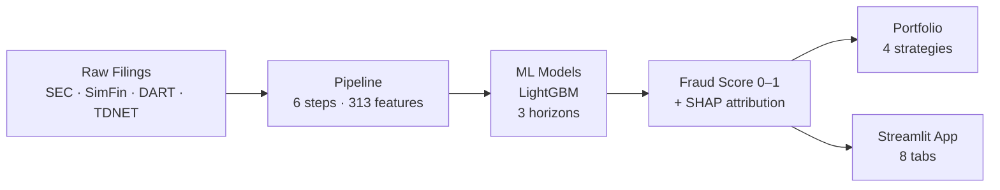

# Stock Fraud Screener

**ML-powered accounting fraud detection across 14 markets — US, Korea, Canada, Japan, Brazil, and 9 European markets.**

The screener trains LightGBM models on 1-year, 3-year, and 5-year horizons using 155,696 company-year observations and 313 features. Each company receives a composite fraud probability score (0–1) with SHAP-based attribution showing which signals drove the score.

---

## Performance at a Glance

| Model Horizon | Validation AUC | Test AUC |
|---|---|---|
| 1-year | 0.776 | 0.749 |
| 3-year | 0.795 | 0.780 |
| 5-year | 0.860 | 0.856 |

| Strategy | CAGR (net) | Excess vs Benchmark | Sharpe |
|---|---|---|---|
| COMPOSITE | +25.0% | +13.1% | 1.327 |
| QEM | +14.9% | — | — |
| SCDV | +18.1% | — | — |
| IARB | — | — | — |

---

## Choose Your Starting Point

=== "I want to use the app"

    **[Quick Start →](quickstart.md)** — install and launch in 5 minutes

    **[App Walkthrough →](guide/app.md)** — tour of all 8 tabs

    **[Score Interpretation →](guide/scores.md)** — what the numbers mean

=== "I want to understand the research"

    **[Architecture →](architecture.md)** — system overview and data flow

    **[ML Models →](methodology/models.md)** — feature selection, training, ensembling

    **[Backtesting →](methodology/backtesting.md)** — walk-forward validation methodology

    **[Bias & Validation →](methodology/bias-validation.md)** — look-ahead, survivorship, leakage audits

=== "I want to run / extend the code"

    **[Developer Setup →](developer/setup.md)** — clone, install, run

    **[Scripts Reference →](developer/scripts.md)** — every script, every flag

    **[Deployment →](developer/deployment.md)** — Streamlit Cloud + GitHub Actions

    **[Monitoring →](developer/monitoring.md)** — PSI drift alerts, CI workflows

=== "I want to understand the strategy"

    **[Strategies →](guide/strategies.md)** — four portfolio construction approaches

    **[Leverage Strategy →](methodology/leverage.md)** — long/short with Kelly sizing

    **[Factor Research →](methodology/factor-research.md)** — IC/ICIR analysis, factor decay

---

## What It Does

---

## Key Design Decisions

- **Point-in-time features only** — each snapshot uses only information available at fiscal year-end; no look-ahead bias
- **Three horizons** — 1y, 3y, 5y models capture different fraud manifestation timescales
- **ICIR-selected features** — ~35 features per horizon selected by information coefficient stability, then Spearman-deduped at r > 0.90
- **Calibrated probabilities** — Platt scaling applied so scores are interpretable as actual probabilities
- **Survivorship bias audit** — universe includes all companies that existed during the period, not just survivors
