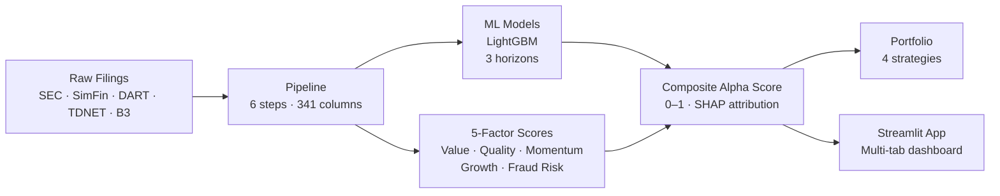

# Multi-Factor Stock Screener

**A research-grade quantitative alpha generation platform covering 14 markets — US, Korea, Canada, Japan, Brazil, and 9 European markets.**

The platform scores companies across five orthogonal factor groups — **Value, Quality, Momentum, Growth, and Fraud Risk** — and combines them into a composite alpha score. It trains LightGBM models on 1-year, 3-year, and 5-year return horizons using 58,190 company-year observations and 346 columns (340 features + 6 alpha scores). Each company receives a SHAP-based attribution showing which signals drove its score.

---

## Performance at a Glance

| Model Horizon | Validation AUC | WF Mean AUC | Target (≥ 0.62) |
|---|---|---|---|
| 1-year | 0.577 | 0.553 | ❌ |
| 3-year | 0.740 | 0.643 | ✅ |
| 5-year | — | 0.597 | ❌ |

| Strategy | CAGR (net) | Excess vs Benchmark | Sharpe |
|---|---|---|---|
| COMPOSITE | +25.0% | +13.1% | 1.327 |
| QEM | +14.9% | — | — |
| SCDV | +18.1% | — | — |
| IARB | — | — | — |

!!! warning "Benchmark note"
    Excess return is currently computed against equal-weight universe mean, not SPY. Numbers will be revised once the SPY benchmark is wired in Phase 0.

---

## Choose Your Starting Point

=== "I want to use the app"

    **[Quick Start →](quickstart.md)** — install and launch in 5 minutes

    **[App Walkthrough →](guide/app.md)** — tour of all tabs

    **[Score Interpretation →](guide/scores.md)** — what the numbers mean

=== "I want to understand the research"

    **[Architecture →](architecture.md)** — system overview and data flow

    **[Factor Library →](methodology/factor-library.md)** — 5-factor design, IC targets, composite weights

    **[ML Models →](methodology/models.md)** — feature selection, training, ensembling

    **[Backtesting →](methodology/backtesting.md)** — walk-forward validation methodology

    **[Bias & Validation →](methodology/bias-validation.md)** — look-ahead, survivorship, leakage audits

=== "I want to run / extend the code"

    **[Developer Setup →](developer/setup.md)** — clone, install, run

    **[Scripts Reference →](developer/scripts.md)** — every script in scripts/, every flag

    **[Pipeline Modules →](developer/pipeline-scripts.md)** — every module in pipeline/

    **[Deployment →](developer/deployment.md)** — Streamlit Cloud + GitHub Actions

    **[Monitoring →](developer/monitoring.md)** — PSI drift alerts, CI workflows

=== "I want to understand the strategy"

    **[Strategies →](guide/strategies.md)** — four portfolio construction approaches

    **[Leverage Strategy →](methodology/leverage.md)** — long/short with Kelly sizing

    **[Factor Research →](methodology/factor-research.md)** — IC/ICIR analysis, factor decay

---

## System Architecture

---

## The Five Factors

| Factor | What it measures | Key signals |
|---|---|---|
| **Value** | Cheapness vs intrinsic value | P/B, EV/EBITDA, P/E, FCF yield |
| **Quality** | Balance sheet and earnings quality | ROE, accruals, Piotroski F-Score, gross margin stability |
| **Momentum** | Price trend persistence | 12m-1m return, earnings revision |
| **Growth** | Fundamental growth trajectory | Revenue CAGR, EPS acceleration, reinvestment rate |
| **Fraud Risk** | Accounting manipulation signals | Beneish M-Score, AAER labels, ml_1y/3y/5y fraud probability |

---

## Key Design Decisions

- **Point-in-time features only** — each snapshot uses only information available at fiscal year-end; no look-ahead bias
- **Three horizons** — 1y, 3y, 5y models capture different return manifestation timescales
- **ICIR-selected features** — ~35 features per horizon selected by information coefficient stability, then Spearman-deduped at r > 0.90
- **Calibrated probabilities** — Platt scaling applied so fraud scores are interpretable as actual probabilities
- **Survivorship bias corrected** — universe includes all companies that existed during the period; delisted rows imputed with −50% return
- **AAER-based fraud labels** — 492 positive training rows from 118 confirmed SEC enforcement companies (2× baseline coverage)
