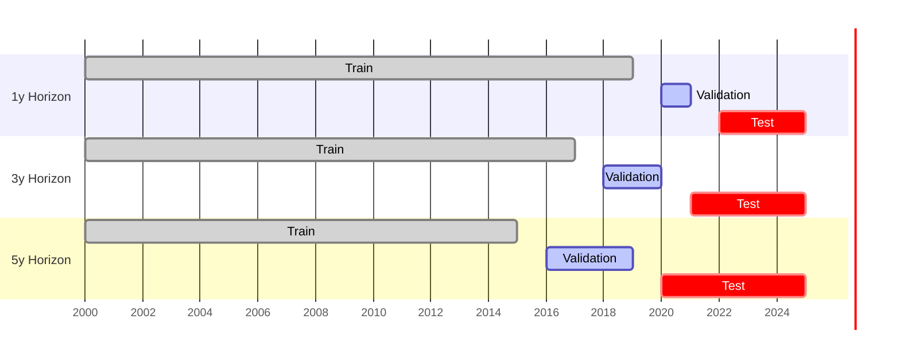

# Backtesting

## Walk-Forward Validation

The screener uses walk-forward (out-of-sample) backtesting. For each year Y:

1. **Train** on all data with `fiscal_year ≤ Y − 1`
2. **Score** companies in year Y using the Y−1 trained model
3. **Invest** at the start of year Y+1 (after fiscal year data is published)
4. **Measure** return over the next 12 months

This means the model never sees future data. Every backtest return is genuinely out-of-sample.



## Portfolio Construction in Backtest

For each fiscal year Y (out-of-sample window):

1. Score all companies in year Y using the model trained on ≤ Y−1 data
2. Apply strategy filter (COMPOSITE: score < 0.30; QEM: score < 0.30 + F ≥ 6 + momentum > 0; etc.)
3. Select top N companies
4. Equal-weight the portfolio
5. Compute 12-month return from fiscal year publication date
6. Compare to benchmark (S&P 500 for US, local index for others)

## Cost Model

Transaction costs are modeled explicitly:

```python
COST_PER_TRADE_BPS = 30     # 0.30% per trade (buy + sell)
SLIPPAGE_BUFFER    = 10     # 0.10% additional for small caps
ANNUAL_TURNOVER    = ~0.6   # ~60% portfolio turnover per year
```

Net CAGR = Gross CAGR − (turnover × cost_per_trade)

## Performance Metrics

| Metric | Formula | Threshold |
|---|---|---|
| CAGR | `(final_wealth^(1/n_years) - 1) × 100` | > 15% |
| Sharpe | `mean(annual_excess) / std(annual_excess)` | > 1.0 |
| Sortino | `mean(excess) / std(negative_excess only)` | > 1.5 |
| Calmar | `CAGR / abs(max_drawdown)` | > 1.0 |
| Max Drawdown | `max((peak - trough) / peak)` | < 30% |
| Hit Rate | `years with positive excess / total years` | > 55% |

## Reported Results

| Strategy | CAGR (net) | Excess CAGR | Sharpe | Max Drawdown |
|---|---|---|---|---|
| COMPOSITE | +25.0% | +13.1% | 1.327 | — |
| QEM | +14.9% | — | — | — |
| SCDV | +18.1% | — | — | — |

## Running the Backtester

```bash
# Run all strategies
python3 scripts/backtester.py

# Single strategy
python3 scripts/backtester.py --strategy composite --top 25

# Custom cost model
python3 scripts/backtester.py --cost-bps 50

# Output to specific path
python3 scripts/backtester.py --output data/backtest_results.json
```

Output: `data/backtest_results.json` — consumed by `generate_reports.py` and the Backtest tab in the app.

## Important Caveats

!!! warning "Backtest limitations"
    1. **Small sample size** — walk-forward results cover ~5–10 OOS years depending on the horizon. Statistical significance is limited.
    2. **US only** — backtest is currently US-only. Results may not generalize to other markets.
    3. **Look-ahead risk** — we use `fiscal_year` as the cutoff, not `filing_date`. Companies with late filings may introduce a small amount of look-ahead. Phase 0a of the roadmap will fix this with point-in-time filing dates.
    4. **Survivorship risk** — the training universe is not yet survivorship-bias-free. Phase 0b will add delisted companies to the training set.
