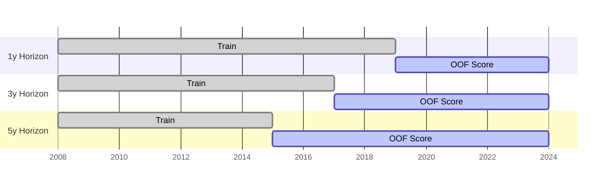

# Backtesting

## Walk-Forward Validation

The screener uses walk-forward (out-of-sample) backtesting. For each year Y:

1. **Train** on all data with `fiscal_year ≤ Y − 1` AND `filed_date < Jan 1 of Y` (PIT-safe)
2. **Score** companies in year Y using the Y−1 trained model
3. **Invest** at the start of year Y+1 (after fiscal year data is published)
4. **Measure** return over the next 12 months

Both the `fiscal_year` cutoff and the `filed_date` cutoff are applied, so companies that filed
their annual report late cannot leak into training. Every backtest return is genuinely out-of-sample.



## SPY Benchmark (Primary)

Starting Phase C, the primary benchmark is **SPY (S&P 500 ETF)** calendar-year total returns
(dividends included), downloaded via `scripts/fetch_spy_returns.py` and stored in
`data/spy_returns.csv`.

The equal-weight universe mean is retained as a **secondary** metric (`excess_vs_univ`) but is
no longer used to compute the headline excess return figure.

| Metric | Benchmark |
|---|---|
| `excess_cagr_pct` | Portfolio CAGR − SPY CAGR |
| `excess_cagr_vs_spy` | Same as above |
| `bench_cagr_pct` | SPY CAGR over backtest period |
| `excess_vs_univ` | Portfolio CAGR − equal-weight universe CAGR (secondary) |

## Portfolio Construction

For each fiscal year Y (out-of-sample window):

1. Score all companies in year Y using the model trained on filed_date < Jan 1 of Y
2. Apply strategy filter (COMPOSITE, QEM, SCDV, IARB — each with specific factor thresholds)
3. Select top N companies
4. Apply **inverse-volatility weighting** (capped at 20% per position, 35% per sector)
5. Compute 12-month return
6. Compare to SPY benchmark

## Transaction Cost Model

Costs are applied per-pick based on size category:

| Size Category | Round-Trip Cost | Rationale |
|---|---|---|
| Large / mid cap | 30 bps | 10 bps commission + 20 bps slippage |
| Micro / small cap | 60 bps | Additional illiquidity premium |

Annual cost drag is tracked per-strategy in `avg_cost_drag_bps` output.

## Factor Attribution

For each strategy, factor attribution is computed via OLS regression of portfolio returns on SPY:

```
port_return(t) = alpha + beta × spy_return(t) + error(t)
```

| Output field | Meaning |
|---|---|
| `beta_vs_spy` | Systematic market exposure (OLS slope) |
| `alpha_vs_spy` | Jensen's alpha — annual intercept above market-explained return |
| `r_squared_vs_spy` | Fraction of return variance explained by market beta |
| `tracking_error` | Std dev of annual excess returns vs SPY |

A high `alpha_vs_spy` with low `beta_vs_spy` indicates the strategy is generating genuine
factor alpha, not just leveraged market beta.

## Performance Metrics

| Metric | Formula | Target |
|---|---|---|
| CAGR | `(final_wealth^(1/n_years) - 1) × 100` | > 15% |
| Sharpe | `(CAGR − 3%) / std(annual_returns)` | > 1.0 |
| Sortino | `(CAGR − 3%) / downside_vol` (≥ 3 neg years) | > 1.5 |
| Calmar | `CAGR / abs(max_drawdown)` (MaxDD ≥ 2%) | > 1.0 |
| Max Drawdown | `max((peak − trough) / peak)` | < 30% |
| Hit Rate | `years with positive port return / total years` | > 55% |
| VaR 95% | 5th percentile of annual returns (historical) | |
| Annual Turnover | Approx from avg picks / top_n | |

## Output Fields (backtest_results.json)

Each strategy result includes:

```json
{
  "cagr_pct":                12.4,
  "bench_cagr_pct":          10.1,
  "excess_cagr_pct":         2.3,
  "benchmark_source":        "SPY",
  "spy_cagr_pct":            10.1,
  "excess_cagr_vs_spy":      2.3,
  "beta_vs_spy":             0.82,
  "alpha_vs_spy":            0.023,
  "r_squared_vs_spy":        0.71,
  "tracking_error":          0.087,
  "annual_turnover_pct":     95.0,
  "var_95_pct":             -18.4,
  "max_drawdown_pct":       -26.3,
  "max_drawdown_duration_months": 24,
  "sharpe":                  0.81,
  "sortino":                 1.12,
  "calmar":                  0.47,
  "info_ratio":              0.33,
  "hit_rate_pct":            62.0,
  "avg_cost_drag_bps":       32.1,
  "survivorship_pct":        4.2
}
```

## Running the Backtester

```bash
# Run all strategies (uses SPY if data/spy_returns.csv exists)
python3 scripts/backtester.py

# Fetch SPY data first (required for SPY benchmark)
python3 scripts/fetch_spy_returns.py

# Single strategy with tearsheet
python3 scripts/backtester.py --strategy composite --top 20 --tearsheet

# US market only, custom cost
python3 scripts/backtester.py --market US --cost 40

# Survivorship stress test
python3 scripts/backtester.py --fill-missing -0.5
```

Output: `data/backtest_results.json` — consumed by Section 3 of `notebooks/08_experiment_hub.ipynb`.

## Important Caveats

1. **Small sample** — walk-forward results cover ~8–12 OOS years. Sharpe/alpha estimates have wide confidence intervals.
2. **PIT completeness** — `filed_date` is available for US (SEC EDGAR). Non-US markets may have partial PIT data; the 18-month filing lag filter (`--max-filing-lag 18`) provides a conservative fallback.
3. **Survivorship** — training universe includes delisted companies via `mark_survivorship.py` (−50% imputed return). The `survivorship_pct` field tracks picks with missing forward returns at portfolio date.
4. **FX** — multi-market returns are in local currency. USD conversion is not applied in the default backtest.
