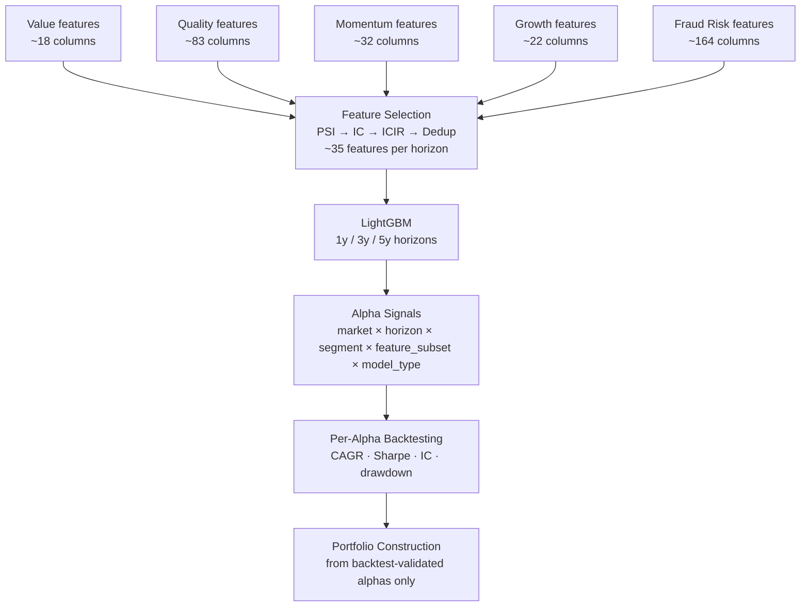

# Factor Group Reference

This document describes the **five factor groups** used in the alpha generation pipeline. These are **input feature categories** fed to the ML models — they are **not** scored with fixed weights and combined into a composite.

The ML models learn which factor groups (and which specific features within them) matter for each market, horizon, and company segment. A model trained on mid-cap US companies may find that FraudRisk and Value features dominate. A model trained on large-cap momentum markets may weight Momentum and Growth features far more heavily. **This is the point.** Fixed-weight composites assume the answer; ML discovers it.

---

## How Factor Groups Flow into Alpha Generation



The feature selection step (PSI → IC → ICIR) independently ranks features across all five groups. No group is guaranteed representation. If FraudRisk features consistently produce higher ICIR on a given market-horizon combination, they will dominate that model's feature set — without any manual specification.

---

## Factor Group 1 — Value

Features measuring how cheaply a company is priced relative to its fundamentals.

| Feature | Formula | Academic Basis |
|---|---|---|
| `price_to_book` | market_cap / book_equity | Fama-French HML factor (Fama & French 1992) |
| `ev_ebitda` | enterprise_value / ebitda | Damodaran enterprise value multiples |
| `pe_ratio` | price / eps_ttm | Classic Graham valuation |
| `fcf_yield` | free_cash_flow / market_cap | Capital-light business premium |
| `ev_revenue` | enterprise_value / revenue | Pre-profit company valuation |
| `ncav` | (current_assets − total_liabilities) / market_cap | Graham Net-Net (Security Analysis, 1934) |
| `earnings_yield` | ebit / enterprise_value | Greenblatt Magic Formula component |
| `acquirers_multiple` | ebit / (market_cap + net_debt) | Carlisle deep value variant |
| `gross_profitability` | (revenue − cogs) / total_assets | Novy-Marx (2013) — profitable value |

**Known predictive direction**: Low multiples → higher future returns (value premium). Sector-relative versions outperform raw multiples in cross-sectional ranking.

**Data source**: SEC EDGAR XBRL financials + yfinance prices, joined at fiscal year-end date.

**Coverage**: US ~98%, EU ~92% (SimFin), KR ~75% (DART), others partial.

---

## Factor Group 2 — Quality

Features measuring the reliability of earnings, balance sheet strength, and capital efficiency.

### Profitability quality

| Feature | Formula | Academic Basis |
|---|---|---|
| `roe` | net_income / avg_book_equity | Fama-French profitability factor (RMW) |
| `roa` | net_income / avg_total_assets | Piotroski (2000) F-Score component |
| `gross_margin` | (revenue − cogs) / revenue | Novy-Marx gross profitability |
| `ebitda_margin` | ebitda / revenue | Operating profitability stability |
| `fcf_to_ni` | free_cash_flow / net_income | < 0.7 persistently = quality red flag |
| `roic` | ebit × (1 − tax_rate) / invested_capital | Greenblatt Magic Formula second component |

### Accruals quality

| Feature | Formula | Signal direction |
|---|---|---|
| `accruals_to_assets` | (net_income − operating_cf) / total_assets | High → lower quality |
| `wc_accruals_to_assets` | ΔWC / avg_assets | Sloan (1996) accrual anomaly |
| `cash_flow_quality` | operating_cf / net_income | < 0.5 → earnings outpacing cash |

### Piotroski F-Score (9-point)

Computed as a single column `piotroski_f_score` (0–9). Individual binary components are also retained as separate features for ML to use at finer granularity.

| Component | Test | Weight |
|---|---|---|
| ROA_pos | roa > 0 | 1 |
| OCF_pos | operating_cf > 0 | 1 |
| ΔROA | roa_t > roa_{t-1} | 1 |
| Accruals | operating_cf / assets > roa | 1 |
| Δleverage | debt_to_assets_t < debt_to_assets_{t-1} | 1 |
| Δliquidity | current_ratio_t > current_ratio_{t-1} | 1 |
| No_dilution | shares_t ≤ shares_{t-1} | 1 |
| Δgross_margin | gross_margin_t > gross_margin_{t-1} | 1 |
| Δasset_turnover | revenue/assets_t > revenue/assets_{t-1} | 1 |

F-Score ≤ 3 = distressed; ≥ 7 = financially strong.

**Data source**: SEC EDGAR XBRL (income statement, balance sheet, cash flow statement).

---

## Factor Group 3 — Momentum

Features measuring price trend persistence and earnings revision dynamics.

!!! warning "Momentum gap — Phase 0 blocker"
    **True cross-sectional momentum is not yet implemented.** The 32 market/price features currently capture price *levels* (raw returns, beta, volatility) — not return *rank relative to peers*. True momentum (Jegadeesh & Titman 1993) requires ranking stocks by 12m-1m return within the cross-section. Adding this is P0.1.

### Currently implemented (available)

| Feature | Description |
|---|---|
| `return_12m` | Total 12-month price return |
| `return_24m` | Total 24-month price return |
| `return_36m` | Total 36-month price return |
| `excess_return_12m` | Stock return minus local index return |
| `beta_12m` | Rolling beta vs local index |
| `price_volume_ratio` | Average daily dollar volume (3-month) |
| `volatility_90d` | 90-day realized price volatility |

### Planned (Phase 0 — P0.1)

| Feature | Formula | Academic Basis |
|---|---|---|
| `momentum_12m1m` | percentile_rank(return_{12m} − return_{1m}) within fiscal year × market | Jegadeesh & Titman (1993) |
| `earnings_revision_1q` | (EPS_estimate_t − EPS_estimate_{t-1}) / \|EPS_estimate_{t-1}\| | Chan et al. (1996) earnings momentum |
| `short_interest_ratio` | short_shares / avg_daily_volume | Short squeeze / crowding signal |

**Data source**: yfinance (price/volume); I/B/E/S consensus via financial data APIs for earnings revisions (planned).

---

## Factor Group 4 — Growth

Features measuring the fundamental growth trajectory and capital allocation quality.

| Feature | Formula | Signal direction |
|---|---|---|
| `revenue_cagr_3y` | (revenue_t / revenue_{t-3})^(1/3) − 1 | High → better (quality-adjusted) |
| `revenue_cagr_5y` | (revenue_t / revenue_{t-5})^(1/5) − 1 | Long-term compounding signal |
| `eps_growth_yoy` | (eps_t − eps_{t-1}) / \|eps_{t-1}\| | Earnings acceleration |
| `asset_growth_yoy` | (total_assets_t − total_assets_{t-1}) / total_assets_{t-1} | High asset growth → lower future returns (Cooper et al. 2008) |
| `capex_to_assets` | capex / total_assets | Reinvestment rate |
| `rd_to_revenue` | r_and_d / revenue | Innovation intensity |
| `sgi` | revenue_t / revenue_{t-1} | Sales Growth Index (Beneish component) |

**Note on asset growth**: Asset growth has a documented *negative* predictive relationship with future returns — companies that expand assets aggressively tend to underperform (Cooper, Gulen & Schill 2008). ML will naturally discover this inversion when trained cross-sectionally; no manual sign-flipping needed.

**Data source**: SEC EDGAR XBRL financials.

---

## Factor Group 5 — Fraud Risk

Forensic accounting signals, governance quality, and classical manipulation indices.

This is the most extensive group (~164 features) because the platform originated from fraud research. These features are ML inputs like any other — they do NOT receive a special role or fixed weight in a composite. Their relevance is learned per market and horizon.

### Beneish M-Score components (8 raw + 1 composite)

| Feature | Formula | Red flag direction |
|---|---|---|
| `dsri` | (receivables_t/revenue_t) / (receivables_{t-1}/revenue_{t-1}) | > 1.05 |
| `gmi` | gross_margin_{t-1} / gross_margin_t | > 1.0 |
| `aqi` | [1 − (CA + PPE) / TA]_t / [same]_{t-1} | Increasing |
| `sgi` | revenue_t / revenue_{t-1} | High alone OK; high + flags = risk |
| `depi` | (depr_{t-1} / (depr_{t-1}+ppe_{t-1})) / same_t | > 1.0 |
| `sgai` | (SGA/rev)_t / (SGA/rev)_{t-1} | Increasing |
| `tata` | (net_income − operating_cf) / total_assets | Large positive |
| `lvgi` | total_liabilities_t / total_assets_t, divided by prior | > 1.0 |
| `beneish_m_score` | −4.84 + 0.92×DSRI + 0.528×GMI + 0.404×AQI + 0.892×SGI + 0.115×DEPI − 0.172×SGAI + 4.679×TATA − 0.327×LVGI | > −1.78 = likely manipulator |

### Altman Z-Score

```
Z = 1.2×(WC/A) + 1.4×(RE/A) + 3.3×(EBIT/A) + 0.6×(MC/TL) + 1.0×(Rev/A)
```

Z < 1.81 = distress; 1.81–2.99 = grey; ≥ 2.99 = safe.

### Governance and audit signals

| Feature | Description |
|---|---|
| `going_concern` | 1 if SEC filing disclosed going concern doubt (via EDGAR EFTS) |
| `auditor_change` | 1 if auditor changed year-over-year |
| `big4_auditor` | 1 if PwC, Deloitte, EY, or KPMG |
| `small_auditor_flag` | Large company (assets > $100M) with non-Big-4 auditor |
| `insider_selling_flag` | Net sold > 10K shares AND sales > buys (Form 4) |

### Fraud taxonomy sub-scores (computed by enrich_fraud_taxonomy.py)

These 0.0–1.0 sub-scores aggregate signals within each fraud mechanism. They are additional feature columns for ML — not the final output.

| Column | Fraud mechanism |
|---|---|
| `fraud_score_accounting` | Earnings manipulation (accruals, channel-stuffing) |
| `fraud_score_dilution` | Equity issuance abuse / dilution fraud |
| `fraud_score_governance` | Governance failures (auditor, board, going concern) |
| `fraud_score_insider` | Insider selling / related-party transactions |
| `fraud_score_macro` | Macro-driven fraud exposure (recession, sector stress) |

### AAER fraud labels

`fraud_confirmed` and `fraud_suspect` binary columns are added by `enrich_fraud_labels.py`. These are **target variable enrichments** for supervised model training, not predictor features. 492 positive rows / 118 companies (US dataset).

**Data sources**: SEC EDGAR XBRL + EFTS full-text search (going concern) + Form 4 filings (insider signals) + AAER/SCAC databases (fraud labels).

---

## Quarterly-Enriched Features (cross-factor, 5 columns)

These features span multiple factor groups and are computed separately from annual data by `scripts/enrich_quarterly_features.py`.

| Feature | Factor group | Description |
|---|---|---|
| `revenue_qoq_std_norm` | Quality / Fraud Risk | Std dev of Q1→Q3 revenue growth (earnings smoothing) |
| `earnings_qoq_mean` | Growth / Quality | Mean QoQ net income growth |
| `max_accruals_ttm` | Fraud Risk | Max \|wc_accruals_to_assets\| across available quarters |
| `revenue_acceleration` | Growth / Momentum | Q3/Q1 revenue ratio (intra-year sales ramp) |
| `quarterly_positive_rev_frac` | Growth | Fraction of quarters with positive QoQ revenue growth |

Coverage: 74.8% of training rows (companies with at least 2 available quarterly filings).

---

## What This Document Is Not

This is not a scoring rubric. There are no fixed weights here. There is no composite "alpha score" computed by summing these groups.

The combination of signals into alpha predictions is the job of the ML models in `scripts/train_models.py`. The combination of alpha signals into a portfolio is the job of `scripts/build_portfolio.py` (Phase 2). Both are data-driven, not manually specified.

For the feature selection methodology that determines which features from these groups actually reach the models, see [Feature Selection →](feature-selection.md).

For how alpha signals are generated from trained models, see Phase 1 in [ROADMAP →](../../ROADMAP.md).
