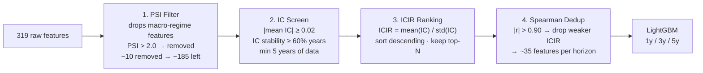

# Feature Selection Methodology

The pipeline selects ~35 features per horizon from an initial pool of ~185 candidates (319 raw features minus PSI-rejected macro features). Selection runs in four sequential filters: **PSI → IC → ICIR → Spearman deduplication**.

---

## Pipeline Overview



---

## Step 1 — PSI Filter

**What**: Population Stability Index measures how much a feature's distribution has shifted between the training period and the current scoring period.

**Formula**:

```
PSI = Σ (P_score_i − P_train_i) × ln(P_score_i / P_train_i)
```

Where `i` indexes 10 equal-frequency buckets of the feature distribution.

**Thresholds**:

| PSI | Interpretation |
|---|---|
| < 0.10 | Stable — no concern |
| 0.10 – 0.20 | Monitor |
| ≥ 0.20 | Alert — feature distribution has shifted |

The training default uses `--max-psi 2.0` (very permissive) to remove only the most extreme macro-regime features (3-month T-bill, CPI, yield spread). This prevents these features from inflating ICIR on stale regime patterns while still allowing macro context features with moderate drift.

**Why before IC**: if a feature's distribution has shifted significantly, its historical IC estimate is unreliable for forward prediction. Computing IC on a drifted feature is garbage-in, garbage-out.

**CLI**: `python3 scripts/train_models.py --max-psi 0.25` lowers threshold to remove all moderately drifted features.

---

## Step 2 — IC Screen

**Information Coefficient (IC)** is Spearman rank correlation between a feature value at fiscal year-end and the forward return over the horizon.

```
IC_t = SpearmanCorr(feature_rank_t, return_rank_{t+h})
```

Computed cross-sectionally within each fiscal year. A positive IC means the feature ranks companies in the right order; IC of 0.05 is considered economically meaningful.

**Filters applied**:

| Flag | Default | Meaning |
|---|---|---|
| `--min-ic` | `0.02` | \|mean IC across years\| must exceed this |
| `--min-ic-stability` | `0.60` | Fraction of years where IC has the same sign as mean IC |
| `--min-ic-years` | `5` | Feature must have valid IC in at least 5 years (prevents ICIR inflation from single-year fluke) |

The stability filter is the most important: a feature with mean IC of 0.04 but only 40% sign consistency is directionally unreliable and gets dropped even if its average looks positive.

---

## Step 3 — ICIR Ranking

**ICIR (Information Coefficient Information Ratio)** is the ratio of mean IC to IC standard deviation across years — a signal-to-noise metric:

```
ICIR = mean(IC_t) / std(IC_t)
```

Higher ICIR means the feature predicts returns *consistently*, not just occasionally. ICIR > 0.5 is a strong signal; most production quant factors operate between 0.3 and 0.8.

After computing ICIR per feature, the pipeline keeps the top-N features by |ICIR| (default `--top-n 40`).

**Why not just use IC?**: A feature with mean IC of 0.06 but std of 0.15 is unstable — it'll be strong in some regimes and flat or inverted in others. ICIR penalises this instability.

### Current Limitations

The current IC implementation treats each year's IC as an independent observation. This understates standard errors because:

1. **Autocorrelation** — IC values in adjacent years are correlated (macro regimes persist)
2. **Cross-sectional dependence** — companies share sector exposures

**Planned (Phase 0)**:

| Improvement | Description |
|---|---|
| **Newey-West HAC standard errors** | Correct for autocorrelation in IC time series using heteroskedasticity-autocorrelation-consistent covariance. Lags = floor(4 × (T/100)^(2/9)). Widens confidence intervals on stable macro-correlated features. |
| **Fama-MacBeth t-statistics** | Run cross-sectional OLS each year; compute t-stat on mean coefficient across years. Standard approach in academic factor research (Fama & MacBeth 1973). |
| **FDR correction (Benjamini-Hochberg)** | With ~185 candidates, ~5% will appear significant by chance. B-H procedure controls False Discovery Rate at q < 0.10, reducing spurious factor selection. |

---

## Step 4 — Spearman Deduplication

After ICIR ranking, correlated features are deduplicated:

1. Compute pairwise Spearman rank correlation matrix on the surviving feature set
2. For any pair with |r| > 0.90: drop the feature with the lower |ICIR|

**Why**: highly correlated features add no independent information but increase model variance. Two features with r = 0.95 are measuring nearly the same thing — keeping both wastes a degree of freedom and inflates feature importance scores.

**Result**: ~35 final features per horizon (from ~40 pre-dedup candidates).

CLI: `python3 scripts/train_models.py --no-dedup` skips this step to see the effect.

---

## Full CLI Reference

```bash
# Run with tighter PSI threshold (removes more macro features)
python3 scripts/train_models.py --max-psi 0.20

# Stricter IC stability requirement
python3 scripts/train_models.py --min-ic-stability 0.65 --min-ic-years 6

# Keep more features before dedup
python3 scripts/train_models.py --top-n 60

# Sector-neutral IC (demean within each sector before computing correlation)
python3 scripts/train_models.py --sector-neutral

# Walk-forward CV to verify ICIR-selected features are stable over time
python3 scripts/train_models.py --walk-forward
```

---

## Outputs

After feature selection, `model_meta.json` records the final feature set per horizon:

```json
{
  "features_1y": ["gross_margin", "accruals_to_assets", "piotroski_f_score", ...],
  "features_3y": ["roe", "revenue_cagr_3y", "beneish_m_score", ...],
  "features_5y": ["ev_ebitda", "asset_turnover", "altman_z_score", ...]
}
```

Use `scripts/factor_research.py` to view IC, ICIR, t-statistic, and factor decay per feature, or to compare which features appear across horizons.

---

## Why Not PCA or Neural Feature Extraction?

The platform deliberately uses interpretable feature selection:

1. **Regulatory / explainability** — a portfolio manager must be able to attribute each stock pick to specific financial signals
2. **Overfitting risk** — with ~155K rows and ~185 candidates, latent feature extraction risks learning noise
3. **Factor decomposition** — the 5-factor framework requires named factors; PCA produces unnamed components that can't be mapped to Value/Quality/Momentum/Growth/Fraud Risk

The Newey-West + FDR improvements (planned Phase 0) address the statistical rigour gap without sacrificing interpretability.
