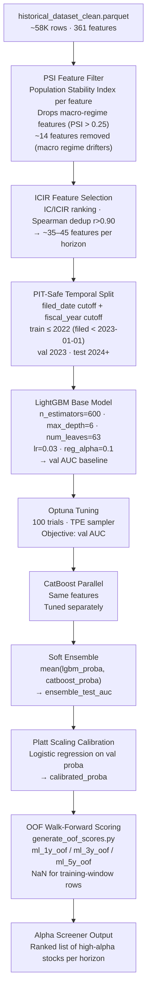

# ML Models

## Training Pipeline



## Model Performance

| Horizon | Train Cutoff | Val AUC | Test AUC | WF Mean AUC | Target |
|---|---|---|---|---|---|
| 6-month | 2022 | 0.607 | 0.506 | 0.563 | ≥ 0.58 ❌ |
| 1-year | 2022 | 0.599 | 0.484 | 0.563 | ≥ 0.62 ❌ |
| 2-year | 2022 | 0.585 | 0.585 | 0.589 | ≥ 0.60 ❌ |
| 3-year | 2022 | 0.635 | — | 0.625 | ≥ 0.62 ✅ |
| 3-year (Optuna-tuned) | 2022 | **0.6644** | — | — | calibrated ensemble 0.6773 |
| 5-year | 2022 | — | — | 0.620 | ≥ 0.62 ✅ |

WF Mean AUC = expanding-window walk-forward CV mean (train on data filed before year t, evaluate year t).
Walk-forward CV uses PIT-safe filed_date cutoff to prevent look-ahead from late SEC filings.
AUC of 0.5 = random. Targets: 3y/5y ≥ 0.62; 1y/2y ≥ 0.60; 6m ≥ 0.58 (shorter horizons are noisier).

> **Phase C update (C1/C2):** `walk_forward_cv()` patched to use `filed_date` cutoff per fold year.
> `generate_oof_scores.py` produces true OOS scores `ml_{h}_oof` for all 5 horizons.
> C2 retraining on Phase B 45/45/41 features + new 6m/2y feature selection runs after this commit.


## Target Variable

The primary target is `beat_local_market` — whether the company's stock beat the local market index over the horizon period.

!!! note "Label quality"
    `beat_local_market` is a proxy label. A company scoring high but not underperforming the market may still have accounting manipulation that hasn't been uncovered yet — or may have found another way to mask it. The Phase 0c roadmap item adds proper fraud labels (SEC AAERs, class actions, restatements) as additional targets.

## LightGBM Configuration

```python
base_params = {
    'objective': 'binary',
    'metric': 'auc',
    'n_estimators': 600,
    'learning_rate': 0.03,
    'num_leaves': 63,
    'max_depth': 6,
    'min_child_samples': 20,
    'subsample': 0.8,
    'colsample_bytree': 0.8,
    'reg_alpha': 0.1,
    'reg_lambda': 0.1,
    'random_state': 42,
    'verbose': -1,
}
```

## Optuna Tuning

100 trials with TPE (Tree-structured Parzen Estimator) sampler. Tuned parameters:

```python
params_to_tune = {
    'num_leaves':         (20, 120),
    'max_depth':          (4, 12),
    'min_child_samples':  (10, 50),
    'learning_rate':      (0.01, 0.15),
    'n_estimators':       (200, 1000),
    'subsample':          (0.6, 1.0),
    'colsample_bytree':   (0.5, 1.0),
    'reg_alpha':          (0.0, 1.0),
    'reg_lambda':         (0.0, 1.0),
}
```

Objective: maximize val AUC. Early stopping patience: 50 rounds.

## CatBoost Ensemble

CatBoost is run with symmetric tree mode on the same ICIR-selected features. The soft ensemble averages predicted probabilities:

```python
ensemble_proba = 0.5 * lgbm.predict_proba(X)[:,1] + 0.5 * catboost.predict_proba(X)[:,1]
```

## Calibration

Platt scaling: a logistic regression is fit on the validation set using raw model probabilities as the single feature. This maps the raw scores onto better-calibrated probabilities.

Without calibration, ML models often output scores that are miscalibrated — a score of 0.8 might not actually correspond to an 80% probability. Calibration fixes this.

## Regression Model — Excess Return Magnitude

Alongside the binary classifiers, a **LightGBM Huber regression** (`model_3y_regression.joblib`) predicts the *magnitude* of 3-year excess return (`excess_return_local_3y`). This is the Stage 3 ranker in the leverage strategy screener.

**Why Huber?** Equity returns have fat tails. Huber regression is robust to the rare +100%/+200% outlier years that would otherwise dominate an MSE fit. `alpha=0.9` sets the Huber transition point at the 90th percentile of residuals.

**Feature set:** Frozen at the 45 ICIR-selected features from `models/feature_sets_3y.json` (same as the binary 3y classifier). No new feature selection is performed on the regression target — this prevents overfitting to the magnitude target while reusing already-validated predictors.

**Target winsorisation:** `excess_return_local_3y` is winsorised at the train-split 1st/99th percentile `[-1.491, 6.347]` before fitting. Percentiles are computed on the train split only (PIT-safe).

| Split | Spearman IC | N rows |
|---|---|---|
| Train | 0.6361 | 32,761 |
| Val | 0.4239 | 390 |
| WF mean (9 folds) | 0.3366 | — |

IC > 0.05 = useful for annual rebalance; IC > 0.10 = strong. WF IC 0.34 indicates meaningful ranking ability across unseen years.

**Output column:** `ml_pred_excess_3y` — written to `historical_dataset_clean.parquet` by `score_historical.py`. Used in `leverage_strategy.py` for Stage 3 sort and Kelly-proportional position weighting.

## Model Artifacts

All model artifacts are saved to `models/`:

| File | Description |
|---|---|
| `model_1y.joblib` | LightGBM 1-year base model |
| `model_3y.joblib` | LightGBM 3-year base model |
| `model_5y.joblib` | LightGBM 5-year base model |
| `model_1y_calibrated.joblib` | Calibrated wrapper |
| `model_3y_calibrated.joblib` | Calibrated wrapper |
| `model_5y_calibrated.joblib` | Calibrated wrapper |
| `model_meta.json` | AUC metrics, feature lists, train medians, cutoff dates |

## Training Commands

```bash
# Base models
python3 scripts/train_models.py

# With Optuna tuning + CatBoost + calibration (slower)
python3 scripts/tune_models.py

# Custom horizon only
python3 scripts/train_models.py --horizon 3y

# With SHAP export
python3 scripts/train_models.py --export-shap

# Walk-forward CV (expanding window, 9 folds)
python3 scripts/train_models.py --walk-forward
```

### Feature Selection Flags

| Flag | Default | Description |
|---|---|---|
| `--max-psi` | `2.0` | Drop features with PSI > threshold before IC analysis |
| `--min-ic` | `0.02` | Minimum \|mean IC\| to pass into candidate set |
| `--min-ic-stability` | `0.6` | Fraction of years IC must agree with mean sign direction |
| `--min-ic-years` | `5` | Minimum years of valid IC data to trust ICIR ranking |
| `--top-n` | `40` | Max features per horizon before deduplication |
| `--no-dedup` | False | Skip Spearman correlation deduplication step |

### Excluded Columns (EXCLUDE set in `train_models.py`)

Certain columns are unconditionally excluded from feature selection regardless of their IC score:

- **Identifier / label columns** — `ticker`, `cik`, `market`, `fiscal_year`, `forward_return_*`, etc.
- **Forward-looking columns** — any column derived from future data
- **`ml_1y`, `ml_3y`, `ml_5y`** — in-sample contamination: `score_historical.py` scores all rows including training rows, so IC is inflated for 2008–`TRAIN_CUTOFF`. **`ml_1y_oof`, `ml_3y_oof`, `ml_5y_oof`** — OOF columns are clean but should not be used as input features (they are the output of the model, not fundamental signals). See `docs/developer/pipeline-integrity.md` Rule 7.
- **`alpha_*` composites** — `alpha_fraud_risk`, `alpha_composite`, `alpha_value`, `alpha_quality`, `alpha_growth`, `alpha_momentum` are hand-crafted composites of raw features. Including them alongside their component features causes double-counting: the composite contributes IC proportional to its raw components, artificially inflating ICIR for the composite while crowding out individual components in deduplication.
