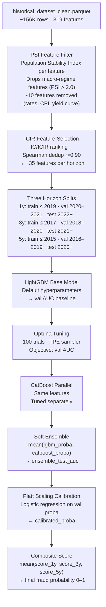

# ML Models

## Training Pipeline



## Model Performance

| Horizon | Train Cutoff | Val AUC | Test AUC | WF Mean AUC | Target |
|---|---|---|---|---|---|
| 1-year | 2019 | 0.577 | 0.537 | 0.553 | ≥ 0.62 |
| 3-year | 2017 | 0.740 | — | 0.643 | ≥ 0.62 ✅ |
| 5-year | 2015 | — | — | 0.597 | ≥ 0.62 |

WF Mean AUC = expanding-window walk-forward CV mean (train on all data ≤ year t, evaluate year t+1).
AUC of 0.5 = random. Target ≥ 0.62 for production deployment.

## Target Variable

The primary target is `beat_local_market` — whether the company's stock beat the local market index over the horizon period.

!!! note "Label quality"
    `beat_local_market` is a proxy label. A company scoring high but not underperforming the market may still have accounting manipulation that hasn't been uncovered yet — or may have found another way to mask it. The Phase 0c roadmap item adds proper fraud labels (SEC AAERs, class actions, restatements) as additional targets.

## LightGBM Configuration

```python
base_params = {
    'objective': 'binary',
    'metric': 'auc',
    'n_estimators': 500,
    'learning_rate': 0.05,
    'num_leaves': 31,
    'min_child_samples': 20,
    'subsample': 0.8,
    'colsample_bytree': 0.8,
    'reg_alpha': 0.1,
    'reg_lambda': 0.1,
    'random_state': 42,
    'verbose': -1,
}
```

## Optuna Tuning

100 trials with TPE (Tree-structured Parzen Estimator) sampler. Tuned parameters:

```python
params_to_tune = {
    'num_leaves':         (20, 120),
    'max_depth':          (4, 12),
    'min_child_samples':  (10, 50),
    'learning_rate':      (0.01, 0.15),
    'n_estimators':       (200, 1000),
    'subsample':          (0.6, 1.0),
    'colsample_bytree':   (0.5, 1.0),
    'reg_alpha':          (0.0, 1.0),
    'reg_lambda':         (0.0, 1.0),
}
```

Objective: maximize val AUC. Early stopping patience: 50 rounds.

## CatBoost Ensemble

CatBoost is run with symmetric tree mode on the same ICIR-selected features. The soft ensemble averages predicted probabilities:

```python
ensemble_proba = 0.5 * lgbm.predict_proba(X)[:,1] + 0.5 * catboost.predict_proba(X)[:,1]
```

## Calibration

Platt scaling: a logistic regression is fit on the validation set using raw model probabilities as the single feature. This maps the raw scores onto better-calibrated probabilities.

Without calibration, ML models often output scores that are miscalibrated — a score of 0.8 might not actually correspond to an 80% probability. Calibration fixes this.

## Model Artifacts

All model artifacts are saved to `models/`:

| File | Description |
|---|---|
| `model_1y.joblib` | LightGBM 1-year base model |
| `model_3y.joblib` | LightGBM 3-year base model |
| `model_5y.joblib` | LightGBM 5-year base model |
| `model_1y_calibrated.joblib` | Calibrated wrapper |
| `model_3y_calibrated.joblib` | Calibrated wrapper |
| `model_5y_calibrated.joblib` | Calibrated wrapper |
| `model_meta.json` | AUC metrics, feature lists, train medians, cutoff dates |

## Training Commands

```bash
# Base models
python3 scripts/train_models.py

# With Optuna tuning + CatBoost + calibration (slower)
python3 scripts/tune_models.py

# Custom horizon only
python3 scripts/train_models.py --horizon 3y

# With SHAP export
python3 scripts/train_models.py --export-shap
```
