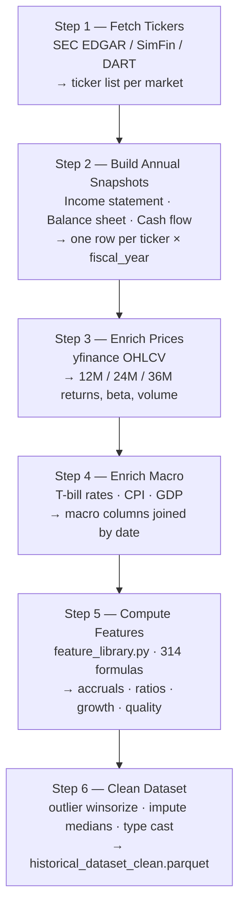

# Data Pipeline

The pipeline transforms raw financial filings into a clean, feature-rich parquet dataset.

## Pipeline Overview



## Step 1 — Fetch Tickers

**Script:** `scripts/run_pipeline.py` (dispatches to market-specific fetchers)

Fetches the universe of companies for each market:

| Market | Source | Method |
|---|---|---|
| US | SEC EDGAR | `/submissions` endpoint, filtered by form type 10-K |
| EU | SimFin | SimFin API `/companies/list` with IFRS flag |
| Korea | DART | `/list` endpoint with auth token |

Output: `data/tickers_{market}.csv` — columns: `ticker`, `cik` (US), `company_name`, `exchange`, `sic_code`, `country`

## Step 2 — Build Annual Snapshots

**Script:** `scripts/run_pipeline.py::build_snapshots()`

For each ticker, fetches annual financial statements and aligns them by `fiscal_year`:

- Income statement: revenue, gross profit, operating income, net income, EPS, EBITDA
- Balance sheet: total assets, current assets, receivables, inventory, PP&E, total debt, equity
- Cash flow: operating CF, investing CF, financing CF, capex, free cash flow

One row = one company × one fiscal year. Missing years are not filled — gaps are preserved.

!!! warning "Fiscal year alignment"
    Companies have different fiscal year ends (Dec 31, Sep 30, Mar 31, etc.). The pipeline uses `fiscal_year` (integer) not calendar year. A company with fiscal year ending March 2024 is tagged `fiscal_year=2024`.

## Step 3 — Enrich Prices

**Script:** `scripts/run_pipeline.py::enrich_prices()`

Downloads daily OHLCV from yfinance and computes:

- `return_12m`, `return_24m`, `return_36m` — total return windows
- `excess_return_12m` — stock return minus local index return
- `beta_12m` — 12-month rolling beta vs local index
- `price_volume_ratio` — average daily dollar volume (3-month)
- `price_to_book`, `ev_ebitda`, `pe_ratio` — valuation ratios at fiscal year-end

## Step 4 — Enrich Macro

**Script:** `scripts/run_pipeline.py::enrich_macro()`

Joins macroeconomic data at the fiscal year-end date:

- `tbill_3m` — 3-month US Treasury yield (or local equivalent)
- `cpi_yoy` — CPI year-over-year inflation
- `gdp_growth` — real GDP growth rate
- `credit_spread` — investment grade credit spread (US: ICE BofA IG index)

Used as context features in the model — fraud patterns can shift with macro cycles.

## Step 5 — Compute Features

**Script:** `scripts/feature_library.py`

Computes 314 base features across 8 categories (plus 5 quarterly-enriched columns added in the next step → 319 total). See [Feature Engineering](features.md) for the full list.

All computations are purely cross-sectional within a fiscal year — no look-forward information is used.

## Step 6 — Clean Dataset

**Script:** `scripts/run_pipeline.py::clean_dataset()`

| Operation | Detail |
|---|---|
| Winsorize | Cap outliers at 1st/99th percentile per feature per fiscal year |
| Impute medians | Replace NaN with industry-year median (SIC 2-digit × fiscal_year) |
| Type cast | Floats to float32, categoricals encoded |
| Period tag | Add `period_type=annual` flag |
| Dedup | Drop duplicate ticker × fiscal_year rows (keep first) |

Output: `data/historical_dataset_clean.parquet`

## Running the Pipeline

```bash
# US only
python3 scripts/run_pipeline.py --market US

# EU (requires SimFin API key in SIMFIN_API_KEY env var)
python3 scripts/run_pipeline_eu.py --market DE

# Korea (requires DART API key in DART_API_KEY env var)
python3 scripts/run_pipeline_kr.py

# All markets
python3 scripts/run_pipeline.py
```

## Incremental Refresh

The GitHub Actions workflow (`refresh_data.yml`) downloads the existing dataset from HuggingFace as a base, runs the pipeline for the specified markets, and merges the new rows before re-uploading. This avoids re-fetching historical data on every run.

See [Deployment](../developer/deployment.md) for the full CI setup.
